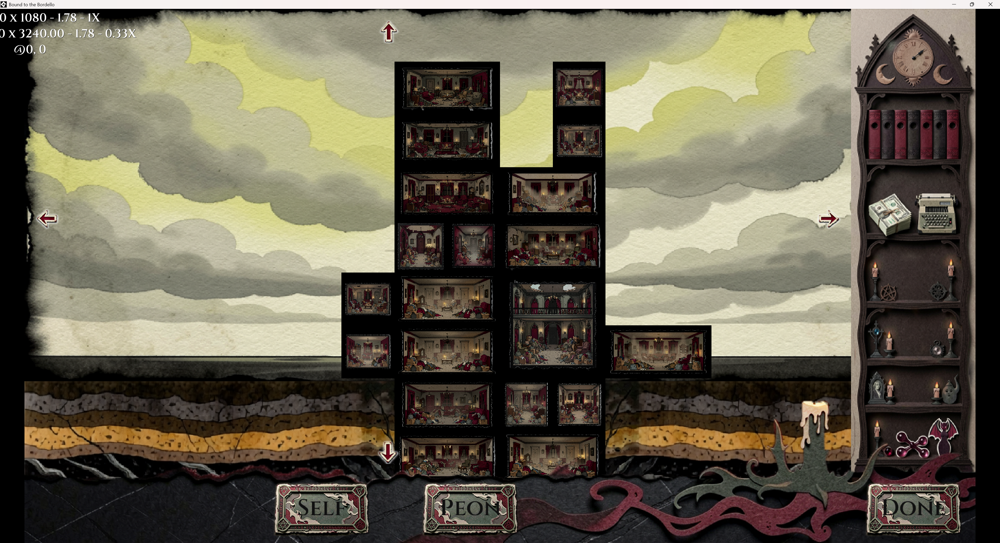

# Bound to the Bordello

> *"I wished for wealth and women… and got exactly what I asked for."*

A dark-comedy horror base-builder / management sim built in **GameMaker Studio**. Set in a small American town in 1969, you've been transformed into a succubus by a demon who granted your greedy wish with ironic precision. Bound to an abandoned mansion, your only path to freedom is to turn the ruin into the region's premier bordello — one night, one guest, and one questionable room at a time.

---

## 📸 Screenshots

### The Dollhouse (Management View)

The vertical side-cutaway of the mansion. Rooms are placed on a grid across Basement → Ground → First Floor → Attic; adjacent placement triggers spatial synergies. Currently showing cluttered-room placeholder art reused across all floors.



---

## 🎮 Gameplay Overview

The game runs on a **Day / Night cycle** across four seasons:

| Phase | What Happens |
|-------|-------------|
| **Day (Management)** | Build & rearrange rooms on the vertical "Dollhouse" grid. Assign minions to chambers. Plan synergies. |
| **Night (Operation)** | Clients arrive and are funneled into chambers based on preferences. Rooms produce resources. Optionally, escort a guest to a Private room to convert them into a minion. |
| **Reckoning** | Collect earnings, check achievements, and roll the next night's visitor list. |

### Core Systems

- **Vertical Dollhouse Grid** – Place rooms across Basement → Ground → First Floor → Attic. Adjacent placement triggers spatial synergies (buffs & penalties). Certain room types are floor-restricted.
- **The Mana Prism** – Three primary resources (*Value*, *Power*, *Stock*) gate seasonal progression, while secondary resources (*Cash*, *Lust / Humiliation / Fear Mana*, *Influence*) drive day-to-day decisions.
- **Chamber Contribution Engine** – Fully data-driven (JSON). Each room's nightly output is calculated from its type definition, installed upgrade, spatial context, and assigned minion/client. See [`CHAMBER_SYSTEM_SPEC.md`](CHAMBER_SYSTEM_SPEC.md).
- **Minion State Machine** – Minions accumulate tags over successive nights based on their room assignment. Progression tracks model degradation (experimented → degraded → scarred → terminal), while recovery rooms strip negative tags. See [`MINION_STATE_SPEC.md`](MINION_STATE_SPEC.md).
- **The Hunt & Conversion** – Convert guests into minions by spending Mana in a Private-tagged room. Tag matches between the room and the guest's preferences reduce conversion cost. Every minion gained is income you'll never earn again (fixed guest pool).
- **Four Seasons Narrative Arc** – Spring (Survival) → Summer (Growth) → Autumn (Crisis) → Winter (Ascension). Each season unlocks new floors, allies, and story beats. The final choice: sacrifice your allies for freedom, conquer the demon, or be dragged to Hell.

### Allies & Gateway Rooms

| Ally | Gateway Room | Progression Flavor |
|------|-------------|-------------------|
| Necromancer | Morgue / Graveyard | Thralls crumble to dust |
| Mad Scientist | Basic Lab | Test subjects get limbs replaced |
| Cult Leader | Ritual Room | Zealots burn out and must be re-converted |
| Aliens | Cow Shed | Cattle age, escape, or are consumed |

---

## 🎨 Visual & UI Direction

The game uses a **Diegetic Paper-Doll** aesthetic. The entire presentation is a layered diorama of parchment, cardstock, and ink cutouts:

- Menus slide in like cards; buttons depress into the background.
- The management view is a vertical side-cutaway (Basement → Attic).
- Interaction scenes (The Hunt, ally negotiations) use atmospheric full-screen vignettes.
- UI assets are flat, high-contrast cutouts manipulated via GML (scaling/rotating), not pre-baked animations — maintaining the "puppet" feel.

---

## 🛠 Tech Stack & Architecture

| Component | Detail |
|-----------|--------|
| **Engine** | GameMaker Studio (GML) |
| **Data Format** | JSON (`datafiles/`) for room types, upgrades, progression tracks |
| **Grid System** | 10 × 8 `ds_grid` (`mansion_map`); rooms occupy 1×1, 2×1, or 2×2 cells |
| **Floor Mapping** | Derived from `grid_y`: Attic (0–1), First (2–3), Ground (4–5), Basement (6–7) |
| **Key Scripts** | `scr_chamber_calc.gml`, `scr_minion_state.gml`, `scr_chamber_types.gml` |
| **UI Approach** | Z-depth layering via Draw GUI events; lerp-based physical transitions |

### Project Structure

```
Bound2Bordello/
├── Bound to the Bordello.yyp      # GameMaker project file
├── datafiles/                     # JSON game data (room types, upgrades, tracks)
│   ├── chamber_types/             #   succubus.json, necromancer.json, …
│   ├── upgrades/                  #   per-ally upgrade definitions
│   └── progression_tracks.json    #   degradation/recovery track definitions
├── docs/
│   └── screenshots/               # In-game screenshots for README & marketing
├── objects/                       # GML object instances (obj_chamber, obj_minion, …)
├── rooms/                         # GameMaker room layouts
├── scripts/                       # Core logic (chamber calc, minion state, loaders)
├── sprites/                       # Art assets
├── sounds/                        # Audio assets
├── fonts/                         # Font definitions
├── options/                       # Platform / build options
├── Game-Design-Document.md        # Full GDD (v2.0)
├── CHAMBER_SYSTEM_SPEC.md         # Chamber contribution technical spec
└── MINION_STATE_SPEC.md           # Minion state machine technical spec
```

---

## 📐 Design Documents

| Document | Contents |
|----------|----------|
| [`Game-Design-Document.md`](Game-Design-Document.md) | High-level concept, core loop, resource economy, friends/archetypes, room specs, minion conversion, narrative progression, technical implementation notes. |
| [`CHAMBER_SYSTEM_SPEC.md`](CHAMBER_SYSTEM_SPEC.md) | Data-driven chamber contribution engine: JSON schemas (types, upgrades, bonus rules, conditions), calculation pipeline, adjacency logic, floor mapping, extensibility guide. |
| [`MINION_STATE_SPEC.md`](MINION_STATE_SPEC.md) | Minion tag/progression system: progression tracks, flat tags, recovery, terminal actions, nightly processing pipeline, Nerd exception, interaction with the chamber system. |

---

## 📋 Status

🚧 **In active development** – Core systems (chamber calculation, minion state machine) are specified and in progress. Narrative content, art assets, and full playtesting are ongoing.

---

## 📄 License

All rights reserved. This project is the original work of [captainbluehacks](https://github.com/captainbluehacks).
